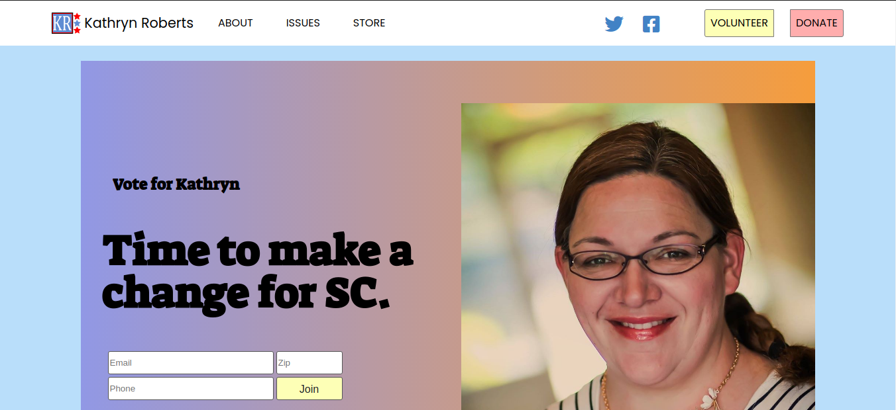

# Kate_v2

This is a re-design of Kathryn's site for her run for the South Carolina Senate seat for the House in 2020. I started work on a re-design for a new look and more functionality when she either won ar ran again.

Site would still be HTML, CSS, and javascript. Bootstrap would still be worked in as before.

The site would include a the following pages to start:
* About
* Issues
* Volunteer
* store

I have the site up to display the new look. No functionality has been started. The css needs to be run through and variable made and code cleaned up.